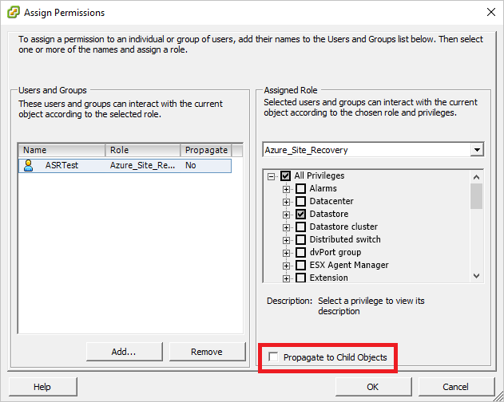
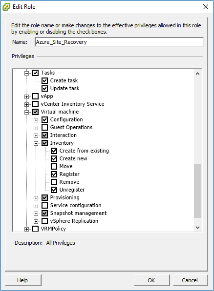
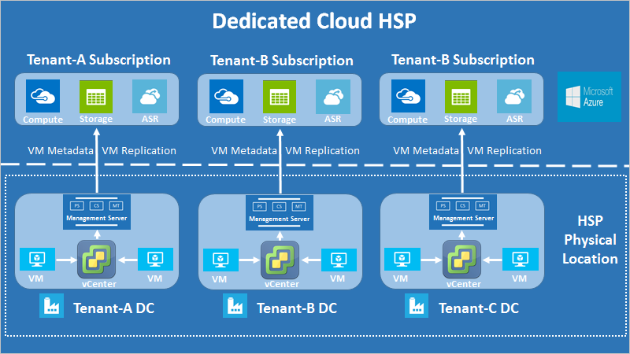

# Multi-tenant support in Azure Site Recovery for replicating VMware virtual machines to Azure through CSP

Azure Site Recovery supports multi-tenant environments for tenant subscriptions. It also supports multi-tenancy for tenant subscriptions that are created and managed through the Microsoft Cloud Solution Provider (CSP) program. This article details the guidance for implementing and managing multi-tenant VMware-to-Azure scenarios. For details on creating and managing tenant subscriptions see [Managing multi-tenancy with CSP](site-recovery-manage-multi-tenancy-with-csp.md) .

This guidance draws heavily from the existing documentation for replicating VMware virtual machines to Azure. For more information, see [Replicate VMware virtual machines to Azure with Site Recovery](site-recovery-vmware-to-azure.md).

## Multi-tenant environments
There are three major multi-tenant models:

* **Shared Hosting Services Provider (HSP)**: The partner owns the physical infrastructure, and uses shared resources (vCenter, datacenters, physical storage, and so on) to host multiple tenants’ VMs on the same infrastructure. The partner can provide disaster-recovery management as a managed service, or the tenant can own disaster recovery as a self-service solution.

* **Dedicated Hosting Services Provider**: The partner owns the physical infrastructure, but uses dedicated resources (multiple vCenters, physical datastores, and so on) to host each tenant’s VMs on a separate infrastructure. The partner can provide disaster-recovery management as a managed service, or the tenant can own it as a self-service solution.

* **Managed Services Provider (MSP)**: The customer owns the physical infrastructure that hosts the VMs, and the partner provides disaster-recovery enablement and management.

## Shared-hosting multi-tenant guidance
This section covers the shared-hosting scenario in detail. The other two scenarios are subsets of the shared-hosting scenario, and they use the same principles. The differences are described at the end of the shared-hosting guidance.

The basic requirement in a multi-tenant scenario is to isolate the various tenants. One tenant should not be able to observe what another tenant has hosted. In a partner-managed environment, this requirement is not as important as it is in a self-service environment, where it can be critical. This guidance assumes that tenant isolation is required.

The architecture is presented in the following diagram:

  
**Shared-hosting scenario with one vCenter**

As seen in the preceding diagram, each customer has a separate management server. This configuration limits tenant access to tenant-specific VMs and enables tenant isolation. A VMware virtual-machine replication scenario uses the configuration server to manage accounts to discover VMs and install agents. The same principles apply to multi-tenant environments, with the addition of restricting VM discovery through vCenter access control.

The data-isolation requirement necessitates that all sensitive infrastructure information (such as access credentials) remains undisclosed to tenants. For this reason, we recommend that all components of the management server remain under the exclusive control of the partner. The management server components are:
* Configuration server (CS)
* Process server (PS)
* Master target server (MT)

A scale-out PS is also under the partner's control.

### Every CS in the multi-tenant scenario uses two accounts

- **vCenter access account**: Use this account to discover tenant VMs. It has vCenter access permissions assigned to it (as described in the next section). To help avoid accidental access leaks, we recommend that partners enter these credentials themselves in the configuration tool.

- **Virtual machine access account**: Use this account to install the mobility agent on the tenant VMs through an automatic push. It is usually a domain account that a tenant might provide to a partner, or one that the partner might manage directly. If a tenant doesn't want to share the details with the partner directly, they can be allowed to enter the credentials through limited-time access to the CS or, with the partner's assistance, install mobility agents manually.

### Requirements for a vCenter access account

As mentioned in the preceding section, you must configure the CS with an account that has a special role assigned to it. The role assignment must be applied to the vCenter access account for each vCenter object and not propagated to the child objects. This configuration ensures tenant isolation, because access propagation can result in accidental access to other objects.

The alternative is to assign the user account and role at the datacenter object and propagate them to the child objects. Then give the account a *No access* role for every object (such as other tenants’ VMs) that should be inaccessible to a particular tenant. This configuration is cumbersome, and it exposes accidental access controls, because every new child object is also automatically granted access that's inherited from the parent. Therefore, we recommend that you use the first approach.

The vCenter account-access procedure is as follows:

1. Create a new role by cloning the pre-defined *Read-only* role, and then give it a convenient name (such as Azure_Site_Recovery, as shown in this example).

2. Assign the following permissions to this role:

   * **Datastore**: Allocate space, Browse datastore, Low-level file operations, Remove file, Update virtual machine files

   * **Network**: Network assign

   * **Resource**: Assign VM to resource pool, Migrate powered off VM, Migrate powered on VM

   * **Tasks**: Create task, Update task

   * **Virtual machine**:
       * Configuration > all
       * Interaction > Answer question, Device connection, Configure CD media, Configure floppy media, Power off, Power on, VMware tools install
       * Inventory > Create from existing, Create new, Register, Unregister
       * Provisioning > Allow virtual machine download, Allow virtual machine files upload
       * Snapshot management > Remove snapshots

     

3. Assign access levels to the vCenter account (used in the tenant CS) for various objects, as follows:

>| Object | Role | Remarks |
>| --- | --- | --- |
>| vCenter | Read-Only | Needed only to allow vCenter access for managing different objects. You can remove this permission if the account is never going to be provided to a tenant or used for any management operations on the vCenter. |
>| Datacenter | Azure_Site_Recovery |  |
>| Host and host cluster | Azure_Site_Recovery | Re-ensures that access is at the object level, so that only accessible hosts have tenant VMs before failover and after failback. |
>| Datastore and datastore cluster | Azure_Site_Recovery | Same as preceding. |
>| Network | Azure_Site_Recovery |  |
>| Management server | Azure_Site_Recovery | Includes access to all components (CS, PS, and MT) outside the CS machine. |
>| Tenant VMs | Azure_Site_Recovery | Ensures that any new tenant VMs of a particular tenant also get this access, or they will not be discoverable through the Azure portal. |

The vCenter account access is now complete. This step fulfills the minimum permissions requirement to complete failback operations. You can also use these access permissions with your existing policies. Just modify your existing permissions set to include role permissions from step 2, detailed previously.

To restrict disaster-recovery operations until the failover state (that is, without failback capabilities), follow the preceding  procedure, with an exception: instead of assigning the *Azure_Site_Recovery* role to the vCenter access account, assign only a *Read-Only* role to that account. This permission set allows VM replication and failover, and it does not allow failback. Everything else in the preceding process remains as is. To ensure tenant isolation and restrict VM discovery, every permission is still assigned at the object level only and not propagated to child objects.

## Other multi-tenant environments

The preceding section described how to set up a multi-tenant environment for a shared hosting solution. The other two major solutions are dedicated hosting and managed service. The architecture for these solutions is described in the following sections.

### Dedicated hosting solution

As shown in the following diagram, the architectural difference in a dedicated hosting solution is that each tenant’s infrastructure is set up for that tenant only. Because tenants are isolated through separate vCenters, the hosting provider must still follow the CSP steps provided for shared hosting but does not need to worry about tenant isolation. CSP setup remains unchanged.

  
**Dedicated hosting scenario with multiple vCenters**

### Managed service solution

As shown in the following diagram, the architectural difference in a managed service solution is that each tenant’s infrastructure is also physically separate from other tenants' infrastructure. This scenario usually exists when the tenant owns the infrastructure and wants a solution provider to manage disaster recovery. Again, because tenants are physically isolated through different infrastructures, the partner needs to follow the CSP steps provided for shared hosting but does not need to worry about tenant isolation. CSP provisioning remains unchanged.

  
**Managed service scenario with multiple vCenters**

## Next steps
[Learn more](site-recovery-role-based-linked-access-control.md) about role-based access control to manage Azure Site Recovery deployments.

[Manage multi-tenancy with CSP](site-recovery-manage-multi-tenancy-with-csp.md)
