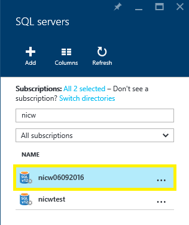
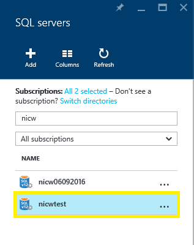
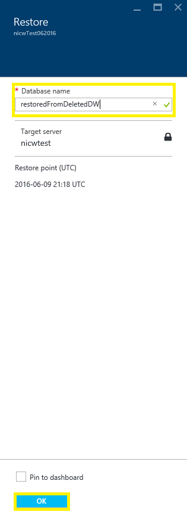

# Restore Azure SQL Data Warehouse (portal)
> [!div class="op_single_selector"]
> * [Overview][Overview]
> * [Portal][Portal]
> * [PowerShell][PowerShell]
> * [REST][REST]
> 
> 
> In this article, you will learn how to restore Azure SQL Data Warehouse by using the Azure portal.

## Before you begin
**Verify your DTU capacity.** Each instance of SQL Data Warehouse is hosted by a SQL server (for example, myserver.database.windows.net) which has a default data throughput unit (DTU) quota. Before you can restore SQL Data Warehouse, verify that your SQL server has enough remaining DTU quota for the database that you're restoring. To learn how to calculate DTU quota or to request more DTUs, see [Request a DTU quota change][Request a DTU quota change].

## Restore an active or paused database
To restore a database:

1. Sign in to the [Azure portal][Azure portal].
2. In the left pane, select **Browse**, and then select **SQL servers**.

    
3. Find your server, and then select it.

    
4. Find the instance of SQL Data Warehouse that you want to restore from, and then select it.

    
5. At the top of the Data Warehouse blade, select **Restore**.

    
6. Specify a new **Database name**.
7. Select the latest **Restore point**.

   Make sure you choose the latest restore point. Because restore points are shown in Coordinated Universal Time (UTC), the default option might not be the latest restore point.

      
8. Select **OK**.
9. The database restore process will begin, and you can use **NOTIFICATIONS** to monitor the process.

> [!NOTE]
> After the restore has finished, you can configure your recovered database by following [Configure your database after recovery][Configure your database after recovery].
>
>

## Restore a deleted database
To restore a deleted database:

1. Sign in to the [Azure portal][Azure portal].
2. In the left pane, select **Browse**, and then select **SQL servers**.

    
3. Find your server, and then select it.

    
4. Scroll down to the **Operations** section on your server's blade.
5. Select the **Deleted databases** tile.

    
6. Select the deleted database that you want to restore.

    
7. Specify a new **Database name**.

    
8. Select **OK**.
9. The database restore process will begin, and you can use **NOTIFICATIONS** to monitor the process.

> [!NOTE]
> To configure your database after the restore has finished, see [Configure your database after recovery][Configure your database after recovery].
>
>

## Next steps
To learn about the business continuity features of Azure SQL Database editions, read the [Azure SQL Database business continuity overview][Azure SQL Database business continuity overview].

<!--Image references-->

<!--Article references-->
[Azure SQL Database business continuity overview]: ../sql-database/sql-database-business-continuity.md
[Overview]: ./sql-data-warehouse-restore-database-overview.md
[Portal]: ./sql-data-warehouse-restore-database-portal.md
[PowerShell]: ./sql-data-warehouse-restore-database-powershell.md
[REST]: ./sql-data-warehouse-restore-database-rest-api.md
[Configure your database after recovery]: ../sql-database/sql-database-disaster-recovery.md#configure-your-database-after-recovery
[Request a DTU quota change]: ./sql-data-warehouse-get-started-create-support-ticket.md

<!--MSDN references-->

<!--Blog references-->

<!--Other Web references-->
[Azure portal]: https://portal.azure.com/
