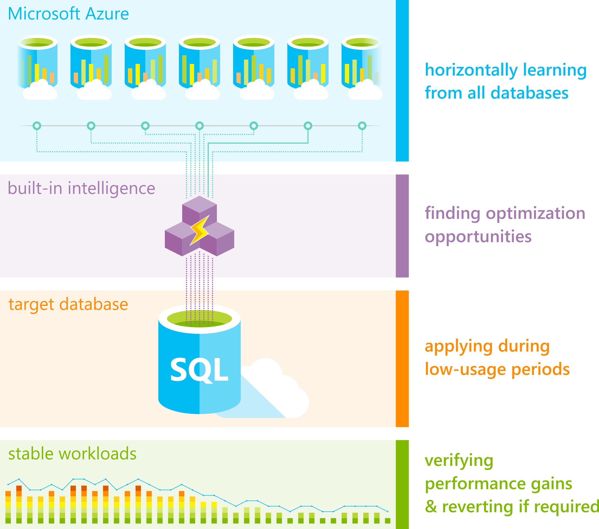

# Automatic tuning in Azure SQL Database

Azure SQL Database Automatic tuning provides peak performance and stable workloads through continuous performance tuning utilizing Artificial Intelligence.

Automatic tuning is a fully managed service that uses built-in intelligence to continuously monitor queries executed on a database and it automatically improves their performance. This is achieved through dynamically adapting database to the changing workloads and applying tuning recommendations. Automatic tuning learns horizontally from all databases on Azure through Artificial Intelligence and it dynamically improves its tuning actions. The longer an Azure SQL Database runs with automatic tuning on, the better it performs.

Azure SQL Database Automatic tuning might be one of the most important features that you can enable to provide stable and peak performing workloads.

## What can Automatic Tuning do for you?

- Automated performance tuning of Azure SQL Databases
- Automated verification of performance gains
- Automated rollback and self-correction
- Tuning history log
- Tuning action T-SQL scripts for manual deployments
- Proactive workload performance monitoring
- Scale out capability on hundreds of thousands of databases
- Positive impact to DevOps resources and the total cost of ownership

## Safe, Reliable and Proven

Tuning operations applied to Azure SQL Databases are fully safe for the performance of your most intense workloads. The system has been designed with care not to interfere with the user workloads. Automated tuning recommendations are applied only at the times of a low utilization. The system can also temporarily disable automatic tuning operations to protect the workload performance. In such case, “Disabled by the system” message will be shown in Azure portal. Automatic tuning regards workloads with the highest resource priority.

Automatic tuning mechanisms are mature and have been perfected on hundreds of thousands of databases running on Azure. Automated tuning operations applied are verified automatically to ensure there is a positive improvement to the workload performance. Regressed performance recommendations are dynamically detected and promptly reverted. Through the tuning history log there is a clear trace of tuning improvements made to each Azure SQL Database. 

Azure SQL Database Automatic tuning is sharing its core logic with the SQL Server automatic tuning engine. For additional technical information on the built-in intelligence mechanism, see [SQL Server automatic tuning](https://docs.microsoft.com/sql/relational-databases/automatic-tuning/automatic-tuning).

## Use Automatic tuning

Automatic tuning needs to be manually enabled on your subscription. To enable automatic tuning using Azure portal, see [Enable automatic tuning](sql-database-automatic-tuning-enable.md).

Automatic tuning can operate autonomously through automatically applying tuning recommendations, including automated verification of performance gains. 

For more control, automatic application of tuning recommendations can be turned off, and tuning recommendations can be manually applied through Azure portal. It is also possible to use the solution to view automated tuning recommendations only and manually apply them through scripts and tools of your choice. 

For an overview of how automatic tuning works and for typical usage scenarios, see the embedded video:

> [!VIDEO https://channel9.msdn.com/Shows/Azure-Friday/Improve-Azure-SQL-Database-Performance-with-Automatic-Tuning/player]
>

## Automatic tuning options

Automatic tuning options available in Azure SQL Database are:
 1. **CREATE INDEX** that identifies the indexes that may improve performance of your workload, creates the indexes, and verifies that they improve performance of the queries.
 2. **DROP INDEX** that identifies redundant and duplicate indexes, and indexes that were not used in the long period of time.
 3. **FORCE LAST GOOD PLAN** that identifies SQL queries that are using execution plan that are slower than previous good plan, and uses the last known good plan instead of the regressed plan.

Azure SQL Database identifies **CREATE INDEX**, **DROP INDEX**, and **FORCE LAST GOOD PLAN** recommendations that can optimize your database and shows them in Azure portal. Find more information about identification of indexes that should be changed at [Find index recommendations in Azure portal](sql-database-advisor-portal.md). You can either manually apply recommendations using the portal or you can let Azure SQL Database to automatically apply recommendations, monitor workload after the change, and verify that the recommendation improved the performance of your workload.

Automatic tuning options can be independently turned on or off per database, or they can be configured on logical server and applied on every database that inherits settings from the server. Configuring Automatic tuning options on the server and inheriting settings on the databases in the server is recommended method for configuring automatic tuning because it simplifies management of automatic tuning options on a large number of databases.

## Next steps

- To enable automatic tuning in Azure SQL Database to manage your workload, see [Enable automatic tuning](sql-database-automatic-tuning-enable.md).
- To manually review and apply Automatic tuning recommendations, see [Find and apply performance recommendations](sql-database-advisor-portal.md).
- To learn about building email notifications for Automatic tuning recommendations, see [Email notifications for automatic tuning](sql-database-automatic-tuning-email-notifications.md)
- To learn about built-in intelligence used in Automatic tuning, see [Artificial Intelligence tunes Azure SQL Databases](https://azure.microsoft.com/blog/artificial-intelligence-tunes-azure-sql-databases/).
- To learn about how Automatic tuning works in Azure SQL Database and SQL server 2017, see [SQL Server automatic tuning](https://docs.microsoft.com/sql/relational-databases/automatic-tuning/automatic-tuning).
