# Use Azure Automation to trigger a job

This article explains how you can use the data transformation feature within the StorSimple Data Manager service to transform StorSimple device data. You can launch a data transformation job in two ways: 

 - Use the .NET SDK
 - Use Azure Automation runbook
 
This article details how to create an Azure Automation runbook and then use it to initiate a data transformation job. To learn more about how to initiate data transformation via .NET SDK, go to [Use .NET SDK to trigger data transformation jobs](storsimple-data-manager-dotnet-jobs.md).

## Prerequisites

Before you begin, ensure that you have:

*   Azure PowerShell installed on the client computer. [Download Azure PowerShell](https://docs.microsoft.com/powershell/azure/install-azurerm-ps).
*   A correctly configured job definition in a StorSimple Data Manager service within a resource group.
*   Download  [`DataTransformationApp.zip`](https://github.com/Azure-Samples/storsimple-dotnet-data-manager-get-started/raw/master/Azure%20Automation%20For%20Data%20Manager/DataTransformationApp.zip) file from the GitHub repository. 
*   Download [`Trigger-DataTransformation-Job.ps1`](https://github.com/Azure-Samples/storsimple-dotnet-data-manager-get-started/blob/master/Azure%20Automation%20For%20Data%20Manager/Trigger-DataTransformation-Job.ps1) script from the GitHub repository.

## Step-by-step procedure

### Set up the Automation account

1. Create an Azure Run As automation account in the Azure portal. To do so, go to **Azure marketplace > Everything** and then search for **Automation**. Select **Automation accounts**.

    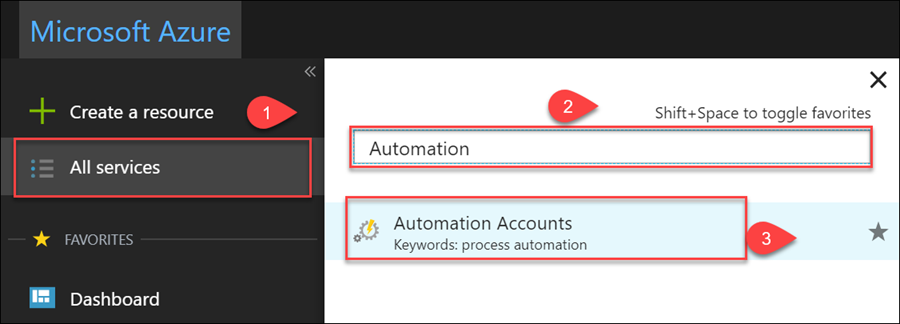

2. To add a new automation account, click **+ Add**.

    

3. In the **Add Automation**:

   1. Supply the **Name** of your automation account.
   2. Select the **Subscription** linked to your StorSimple Data Manager service.
   3. Create a new resource group or select from an existing resource group.
   4. Select a **Location**.
   5. Leave the default **Create Run As account** option selected.
   6. To get a link for quick access on the dashboard, check **Pin to dashboard**. Click **Create**.

      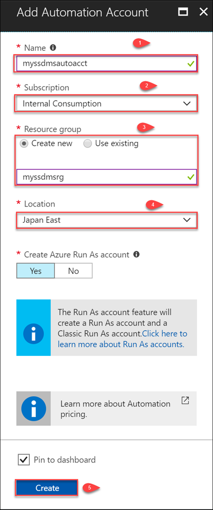
    
      After the automation account is successfully created, you are notified.
    
      

      For more information, go to [Create a Run As account](../automation/automation-create-runas-account.md).

4. In the newly created account, go to **Shared Resources > Modules** and click **+ Add module**.

    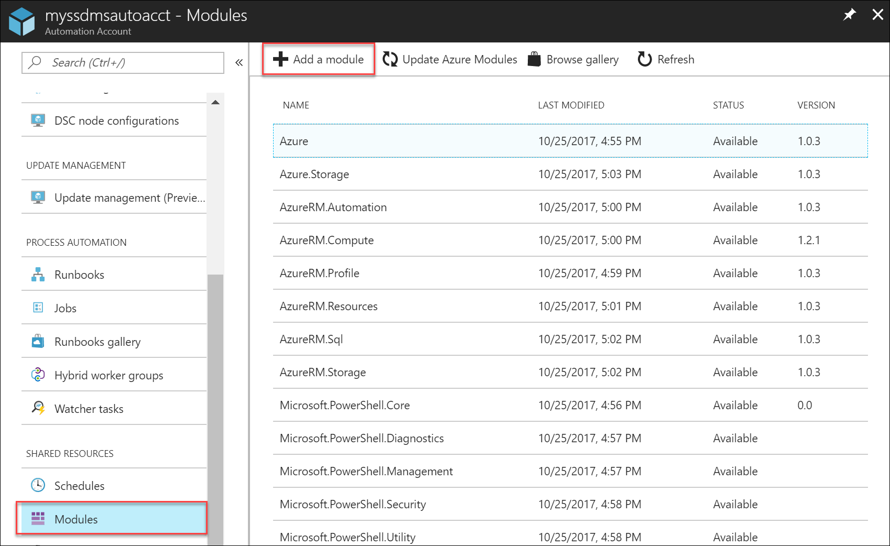

5. Browse to the location of `DataTransformationApp.zip` file from your local computer, and select and open the module. Click **OK** to import the module.

    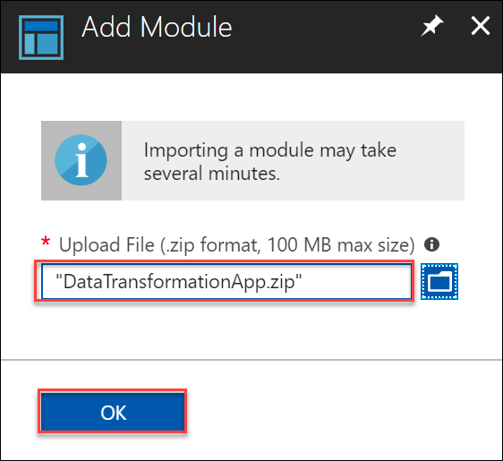

   When Azure Automation imports a module to your account, it extracts metadata about the module. This operation may take a couple of minutes.

   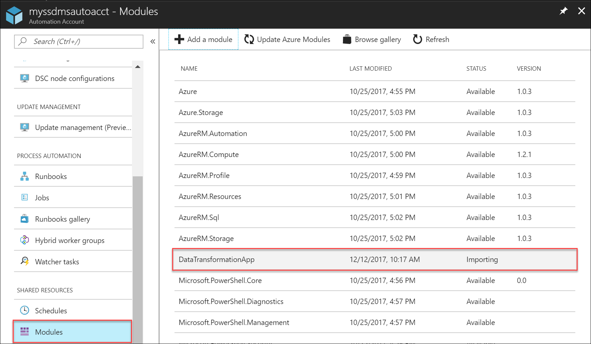

6. You receive a notification that the module is being deployed and another notification when the process is complete.  The status in **Modules** changes to **Available**.

    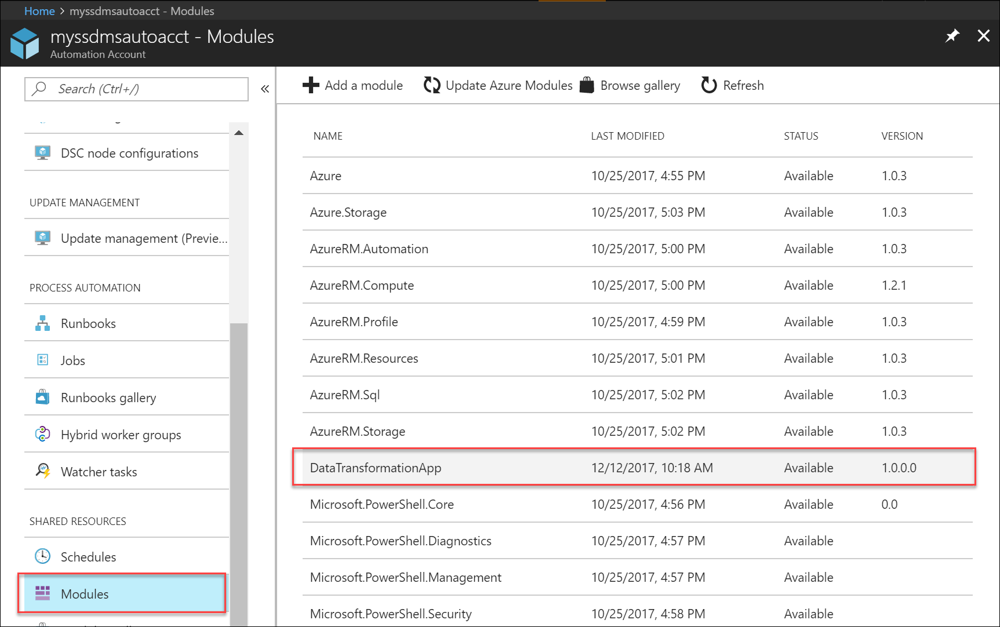

### Import, publish, and run Automation runbook

Perform the following steps to import, publish, and run the runbook to trigger job definition.

1. In the Azure portal, open your Automation account. Go to **Process Automation > Runbooks** and click **+ Add a runbook**.

    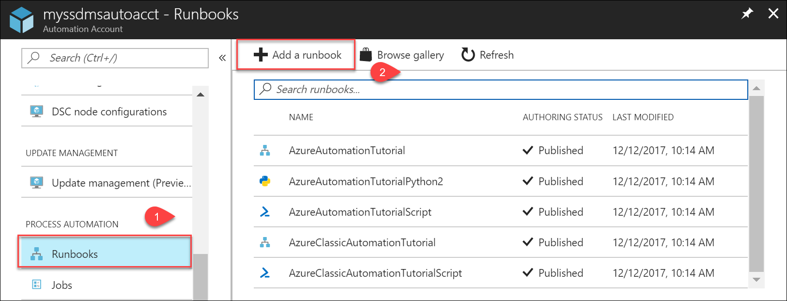

2. In **Add runbook**, click **Import an existing runbook**.

3. Point to the Azure PowerShell script file `Trigger-DataTransformation-Job.ps1` for the **Runbook file**. The runbook type is automatically selected. Provide a name and an optional description for the runbook. Click **Create**.

    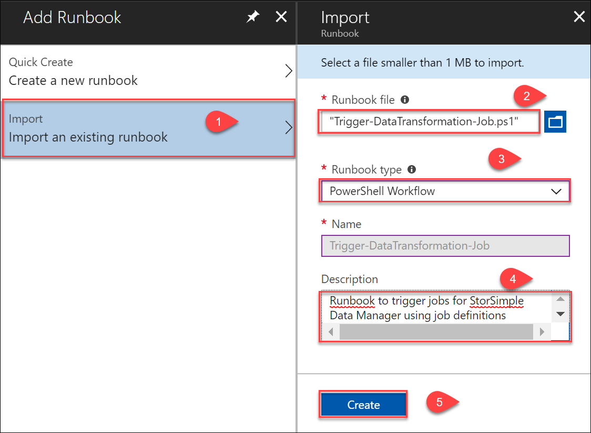

4. The new runbook appears in the list of runbooks for the Automation account. Select and click this runbook.

    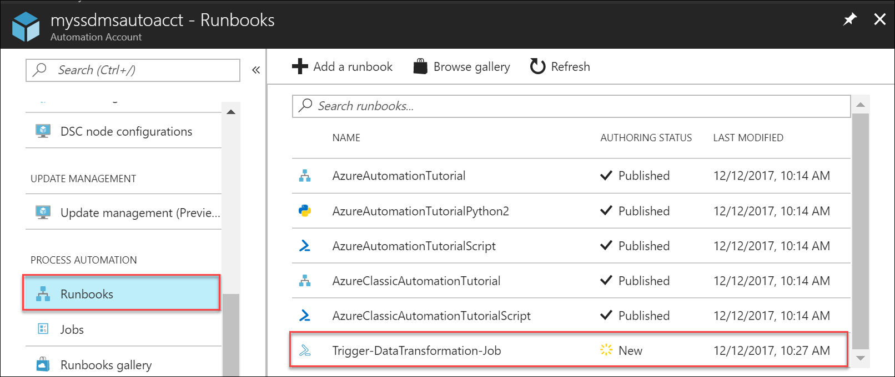

5. Edit the runbook and click **Test** pane.

    

6. Provide the parameters such as the name of your StorSimple Data Manager service, the associated reource group and the job definition name. **Start** the test. The report is generated when the run is complete. For more information, go to how to [test a runbook](../automation/automation-first-runbook-textual-powershell.md#step-3---test-the-runbook).

    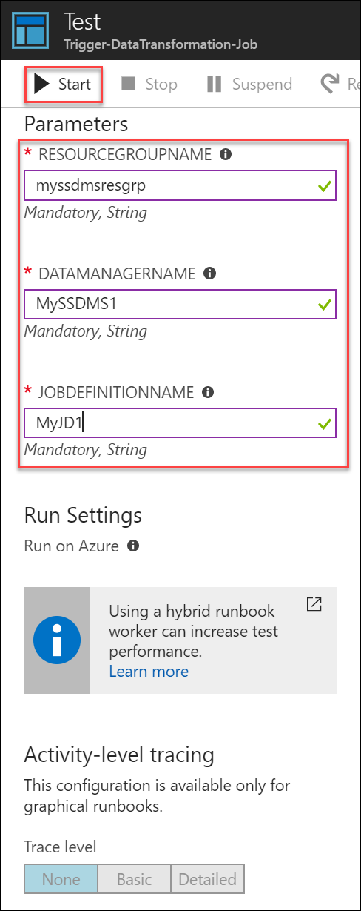    

7. Inspect the output from the runbook in the test pane. If satisfied, close the pane. Click **Publish** and when prompted for confirmation, confirm, and publish the runbook.

    

8. Go back to **Runbooks** and select the newly created runbook.

    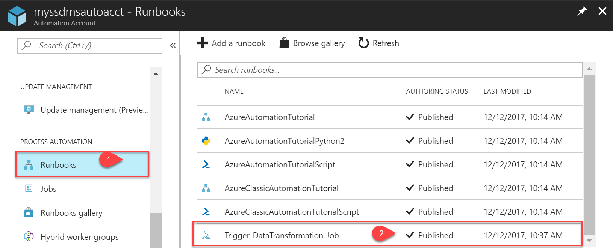

9. **Start** the runbook. In **Start runbook**, enter all the parameters. Click **OK** to submit and start the data transformation job.

10. To monitor the job progress in Azure portal, go to **Jobs** in your StorSimple Data Manager service. Select and click the job to view the job details.

    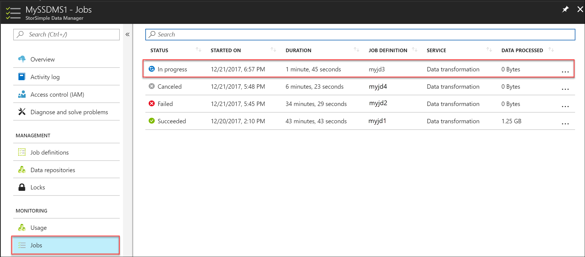

## Next steps

[Use StorSimple Data Manager UI to transform your data](storsimple-data-manager-ui.md).