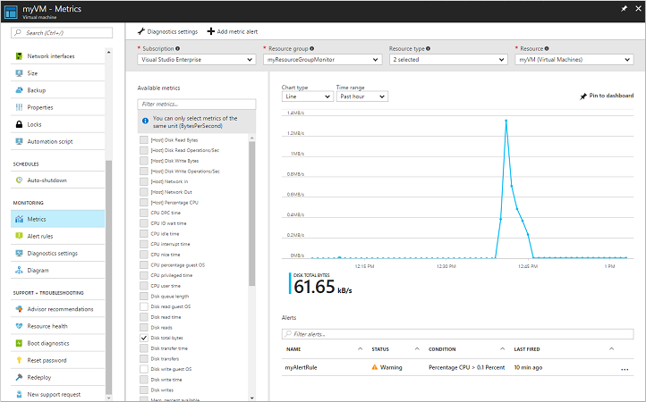
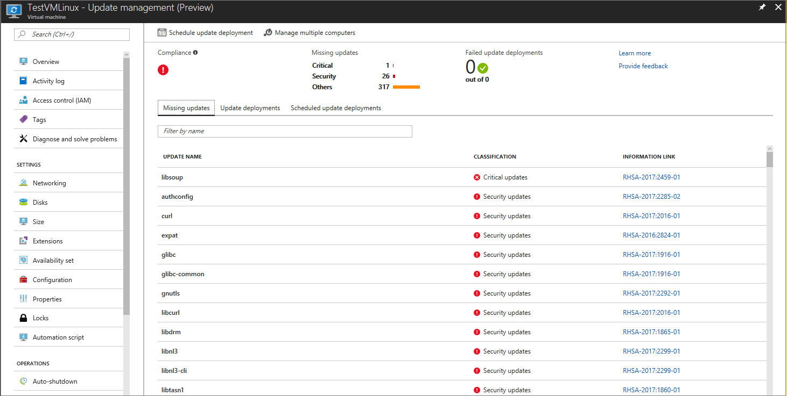
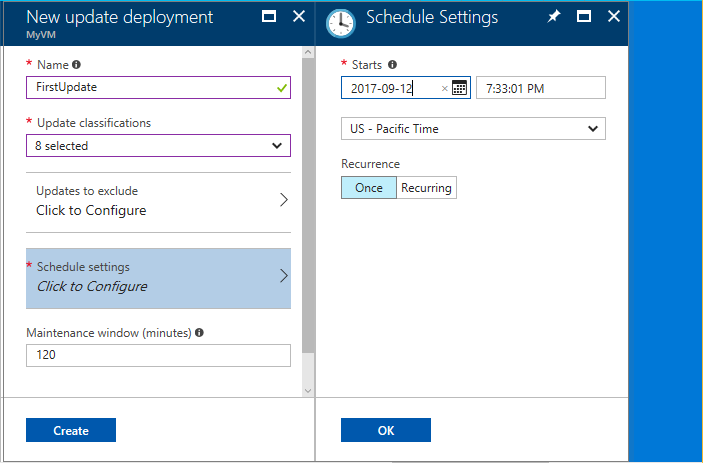
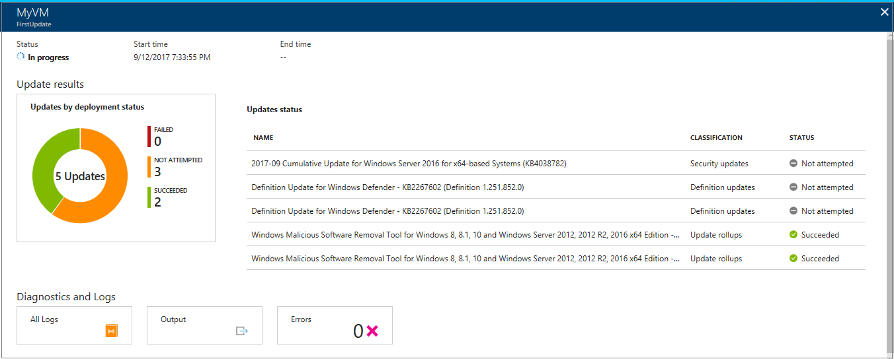

# How to monitor and update a Linux virtual machine in Azure

To ensure your virtual machines (VMs) in Azure are running correctly, you can review boot diagnostics, performance metrics and manage package updates. In this tutorial, you learn how to:

> [!div class="checklist"]
> * Enable boot diagnostics on the VM
> * View boot diagnostics
> * View host metrics
> * Enable diagnostics extension on the VM
> * View VM metrics
> * Create alerts based on diagnostic metrics
> * Manage package updates
> * Set up advanced monitoring


[!INCLUDE [cloud-shell-try-it.md](../../../includes/cloud-shell-try-it.md)]

If you choose to install and use the CLI locally, this tutorial requires that you are running the Azure CLI version 2.0.4 or later. Run `az --version` to find the version. If you need to install or upgrade, see [Install Azure CLI 2.0]( /cli/azure/install-azure-cli). 

## Create VM

To see diagnostics and metrics in action, you need a VM. First, create a resource group with [az group create](/cli/azure/group#az_group_create). The following example creates a resource group named *myResourceGroupMonitor* in the *eastus* location.

```azurecli-interactive 
az group create --name myResourceGroupMonitor --location eastus
```

Now create a VM with [az vm create](https://docs.microsoft.com/cli/azure/vm#az_vm_create). The following example creates a VM named *myVM*:

```azurecli-interactive 
az vm create \
  --resource-group myResourceGroupMonitor \
  --name myVM \
  --image UbuntuLTS \
  --admin-username azureuser \
  --generate-ssh-keys
```

## Enable boot diagnostics

As Linux VMs boot, the boot diagnostic extension captures boot output and stores it in Azure storage. This data can be used to troubleshoot VM boot issues. Boot diagnostics are not automatically enabled when you create a Linux VM using the Azure CLI.

Before enabling boot diagnostics, a storage account needs to be created for storing boot logs. Storage accounts must have a globally unique name, be between 3 and 24 characters, and must contain only numbers and lowercase letters. Create a storage account with the [az storage account create](/cli/azure/storage/account#az_storage_account_create) command. In this example, a random string is used to create a unique storage account name. 

```azurecli-interactive 
storageacct=mydiagdata$RANDOM

az storage account create \
  --resource-group myResourceGroupMonitor \
  --name $storageacct \
  --sku Standard_LRS \
  --location eastus
```

When enabling boot diagnostics, the URI to the blob storage container is needed. The following command queries the storage account to return this URI. The URI value is stored in a variable names *bloburi*, which is used in the next step.

```azurecli-interactive 
bloburi=$(az storage account show --resource-group myResourceGroupMonitor --name $storageacct --query 'primaryEndpoints.blob' -o tsv)
```

Now enable boot diagnostics with [az vm boot-diagnostics enable](https://docs.microsoft.com/cli/azure/vm/boot-diagnostics#az_vm_boot_diagnostics_enable). The `--storage` value is the blob URI collected in the previous step.

```azurecli-interactive 
az vm boot-diagnostics enable \
  --resource-group myResourceGroupMonitor \
  --name myVM \
  --storage $bloburi
```


## View boot diagnostics

When boot diagnostics are enabled, each time you stop and start the VM, information about the boot process is written to a log file. For this example, first deallocate the VM with the [az vm deallocate](/cli/azure/vm#az_vm_deallocate) command as follows:

```azurecli-interactive 
az vm deallocate --resource-group myResourceGroupMonitor --name myVM
```

Now start the VM with the [az vm start]( /cli/azure/vm#az_vm_stop) command as follows:

```azurecli-interactive 
az vm start --resource-group myResourceGroupMonitor --name myVM
```

You can get the boot diagnostic data for *myVM* with the [az vm boot-diagnostics get-boot-log](https://docs.microsoft.com/cli/azure/vm/boot-diagnostics#az_vm_boot_diagnostics_get_boot_log) command as follows:

```azurecli-interactive 
az vm boot-diagnostics get-boot-log --resource-group myResourceGroupMonitor --name myVM
```


## View host metrics

A Linux VM has a dedicated host in Azure that it interacts with. Metrics are automatically collected for the host and can be viewed in the Azure portal as follows:

1. In the Azure portal, click **Resource Groups**, select **myResourceGroupMonitor**, and then select **myVM** in the resource list.
1. To see how the host VM is performing, click **Metrics** on the VM blade, then select any of the *[Host]* metrics under **Available metrics**.

    


## Install diagnostics extension

> [!IMPORTANT]
> This document describes version 2.3 of the Linux Diagnostic Extension, which has been deprecated. Version 2.3 will be supported until June 30, 2018.
>
> Version 3.0 of the Linux Diagnostic Extension can be enabled instead. For more information, see [the documentation](./diagnostic-extension.md).

The basic host metrics are available, but to see more granular and VM-specific metrics, you need to install the Azure diagnostics extension on the VM. The Azure diagnostics extension allows additional monitoring and diagnostics data to be retrieved from the VM. You can view these performance metrics and create alerts based on how the VM performs. The diagnostic extension is installed through the Azure portal as follows:

1. In the Azure portal, click **Resource Groups**, select **myResourceGroup**, and then select **myVM** in the resource list.
1. Click **Diagnosis settings**. The list shows that *Boot diagnostics* are already enabled from the previous section. Click the check box for *Basic metrics*.
1. In the *Storage account* section, browse to and select the *mydiagdata[1234]* account created in the previous section.
1. Click the **Save** button.

    


## View VM metrics

You can view the VM metrics in the same way that you viewed the host VM metrics:

1. In the Azure portal, click **Resource Groups**, select **myResourceGroup**, and then select **myVM** in the resource list.
1. To see how the VM is performing, click **Metrics** on the VM blade, and then select any of the diagnostics metrics under **Available metrics**.

    


## Create alerts

You can create alerts based on specific performance metrics. Alerts can be used to notify you when average CPU usage exceeds a certain threshold or available free disk space drops below a certain amount, for example. Alerts are displayed in the Azure portal or can be sent via email. You can also trigger Azure Automation runbooks or Azure Logic Apps in response to alerts being generated.

The following example creates an alert for average CPU usage.

1. In the Azure portal, click **Resource Groups**, select **myResourceGroup**, and then select **myVM** in the resource list.
2. Click **Alert rules** on the VM blade, then click **Add metric alert** across the top of the alerts blade.
4. Provide a **Name** for your alert, such as *myAlertRule*
5. To trigger an alert when CPU percentage exceeds 1.0 for five minutes, leave all the other defaults selected.
6. Optionally, check the box for *Email owners, contributors, and readers* to send email notification. The default action is to present a notification in the portal.
7. Click the **OK** button.

## Manage package updates

By using Update management, you can manage package updates and patches for your Azure Linux VMs. Directly from your VM, you can quickly assess the status of available updates, schedule installation of required updates, and review deployment results to verify updates were applied successfully to the VM.

For pricing information, see [Automation pricing for Update management](https://azure.microsoft.com/pricing/details/automation/)

### Enable Update management (Preview)

Enable Update management for your VM

1. On the left-hand side of the screen, select **Virtual machines**.
1. From the list, select a VM.
1. On the VM screen, in the **Operations** section, click **Update management**. The **Enable Update management** screen opens.

Validation is performed to determine if Update management is enabled for this VM. The validation includes checks for a Log Analytics workspace and linked Automation account, and if the solution is in the workspace.

A Log Analytics workspace is used to collect data that is generated by features and services such as Update management. The workspace provides a single location to review and analyze data from multiple sources. To perform additional action on VMs that require updates, Azure Automation allows you to run scripts against VMs, such as to download and apply updates.

The validation process also checks to see if the VM is provisioned with the Microsoft Monitoring Agent (MMA) and hybrid worker. This agent is used to communicate with the VM and obtain information about the update status. 

If these prerequisites are not met, a banner appears that gives you the option to enable the solution.


Click the banner to enable the solution. If any of the following prerequisites were found to be missing after the validation, they will be automatically added:

* [Log Analytics](../../log-analytics/log-analytics-overview.md) workspace
* [Automation](../../automation/automation-offering-get-started.md)
* A [Hybrid runbook worker](../../automation/automation-hybrid-runbook-worker.md) is enabled on the VM

The **Enable Update Management** screen opens. Configure the settings, and click **Enable**.


Enabling the solution can take up to 15 minutes, and during this time you should not close the browser window. After the solution is enabled, information about missing updates from the package manager on the VM flows to Log Analytics.
It can take between 30 minutes and 6 hours for the data to be available for analysis.

### View update assessment

After the **Update management** solution is enabled, the **Update management** screen appears. You can see a list of missing updates on the **Missing updates** tab.



### Schedule an update deployment

To install updates, schedule a deployment that follows your release schedule and maintenance window.

Schedule a new Update Deployment for the VM by clicking **Schedule update deployment** at the top of the **Update management** screen. 
In the **New update deployment** screen, specify the following information:

* **Name** - Provide a unique name to identify the update deployment.
* **Updates to exclude** - select this to enter names of packages to exclude from the update.
* **Schedule settings** - You can either accept the default date and time, which is 30 minutes after current time, or specify a different time. You can also specify whether the deployment occurs once or set up a recurring schedule. Click the Recurring option under Recurrence to set up a recurring schedule.

  

* **Maintenance window (minutes)** - Specify the period of time you want the update deployment to occur within.  This helps ensure changes are performed within your defined maintenance windows. 

After you have completed configuring the schedule, click **Create** button and you return to the status dashboard.
Notice that the **Scheduled** table shows the deployment schedule you created.

> [!WARNING]
> The VM will be restarted automatically after updates are installed if there is enough time in the maintenance window.

Update management uses the existing package manager on your VM to install packages.

### View results of an update deployment

After the scheduled deployment is started, you can see the status for that deployment on the **Update deployments** tab on the **Update management** screen.
If it is currently running, it's status shows as **In progress**. After it completes, if successful, it changes to **Succeeded**.
If there is a failure with one or more updates in the deployment, the status is **Failed**.
Click the completed update deployment to see the dashboard for that update deployment.



In **Update results** tile is a summary of the total number of updates and deployment results on the VM.
In the table to the right is a detailed breakdown of each update and the installation results, which could be one of the following values:

* **Not attempted** - the update was not installed because there was insufficient time available based on the maintenance window duration defined.
* **Succeeded** - the update was successfully downloaded and installed on the VM
* **Failed** - the update failed to download or install on the VM.

Click **All logs** to see all log entries that the deployment created.

Click the **Output** tile to see job stream of the runbook responsible for managing the update deployment on the target VM.

Click **Errors** to see detailed information about any errors from the deployment.

## Advanced monitoring 

You can do more advanced monitoring of your VM by using [Operations Management Suite](https://docs.microsoft.com/azure/operations-management-suite/operations-management-suite-overview). If you haven't already done so, you can sign up for a [free trial](https://www.microsoft.com/en-us/cloud-platform/operations-management-suite-trial) of Operations Management Suite.

When you have access to the OMS portal, you can find the workspace key and workspace identifier on the Settings blade. Replace <workspace-key> and <workspace-id> with the values for from your OMS workspace and then you can use **az vm extension set** to add the OMS extension to the VM:

```azurecli-interactive 
az vm extension set \
  --resource-group myResourceGroupMonitor \
  --vm-name myVM \
  --name OmsAgentForLinux \
  --publisher Microsoft.EnterpriseCloud.Monitoring \
  --version 1.3 \
  --protected-settings '{"workspaceKey": "<workspace-key>"}' \
  --settings '{"workspaceId": "<workspace-id>"}'
```

On the Log Search blade of the OMS portal, you should see *myVM* such as what is shown in the following picture:


## Next steps

In this tutorial, you configured, reviewed, and managed updates for a VM. You learned how to:

> [!div class="checklist"]
> * Enable boot diagnostics on the VM
> * View boot diagnostics
> * View host metrics
> * Enable diagnostics extension on the VM
> * View VM metrics
> * Create alerts based on diagnostic metrics
> * Manage package updates
> * Set up advanced monitoring

Advance to the next tutorial to learn about Azure Security Center.

> [!div class="nextstepaction"]
> [Manage VM security](./tutorial-azure-security.md)
