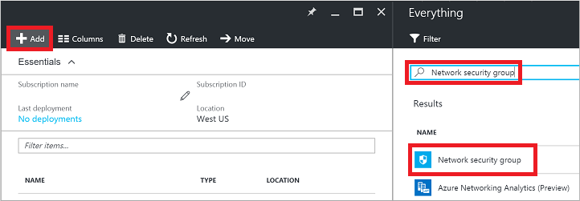
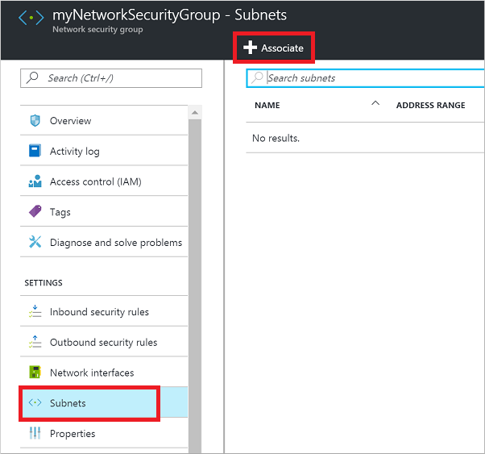

# How to open ports to a virtual machine with the Azure portal
[!INCLUDE [virtual-machines-common-nsg-quickstart](../../../includes/virtual-machines-common-nsg-quickstart.md)]

## Quick commands
You can also [perform these steps using Azure PowerShell](nsg-quickstart-powershell.md).

First, create your Network Security Group. Select a resource group in the portal, choose **Add**, then search for and select **Network security group**:

Enter a name for your Network Security Group, select or create a resource group, and select a location. Select **Create** when finished:

Select your new Network Security Group. Select 'Inbound security rules', then select the **Add** button to create a rule:

To create a rule that allows traffic:

- Select the **Basic** button. By default, the **Advanced** window provides some additional configuration options, such as to define a specific source IP block or port range.
- Choose a common **Service** from the drop-down menu, such as *HTTP*. You can also select *Custom* to provide a specific port to use. 
- If desired, change the priority or name. The priority affects the order in which rules are applied - the lower the numerical value, the earlier the rule is applied.
- When you are ready, select **OK** to create the rule:

Your final step is to associate your Network Security Group with a subnet or a specific network interface. Let's associate the Network Security Group with a subnet. Select **Subnets**, then choose **Associate**:

Select your virtual network, and then select the appropriate subnet:

You have now created a Network Security Group, created an inbound rule that allows traffic on port 80, and associated it with a subnet. Any VMs you connect to that subnet are reachable on port 80.

## More information on Network Security Groups
The quick commands here allow you to get up and running with traffic flowing to your VM. Network Security Groups provide many great features and granularity for controlling access to your resources. You can read more about [creating a Network Security Group and ACL rules here](../../virtual-network/virtual-networks-create-nsg-arm-ps.md).

For highly available web applications, you should place your VMs behind an Azure Load Balancer. The load balancer distributes traffic to VMs, with a Network Security Group that provides traffic filtering. For more information, see [How to load balance Linux virtual machines in Azure to create a highly available application](tutorial-load-balancer.md).

## Next steps
In this example, you created a simple rule to allow HTTP traffic. You can find information on creating more detailed environments in the following articles:

* [Azure Resource Manager overview](../../azure-resource-manager/resource-group-overview.md)
* [What is a Network Security Group (NSG)?](../../virtual-network/virtual-networks-nsg.md)