# Create and install VPN client configuration files for P2S RADIUS authentication

To connect to a virtual network over Point-to-Site, you need to configure the client device from which you will be connecting. The RADIUS server provides multiple authentication options: Username/password authentication, certificate authentication, as well as other authentication types. The VPN client configuration is different for each type of authentication. To configure the VPN client, you use client configuration files that contain the required settings. This article helps you create and install the VPN client configuration for the RADIUS authentication type that you want to use.

### Workflow

1. [Set up the Azure VPN gateway for P2S connectivity](point-to-site-how-to-radius-ps.md).
2. [Set up your RADIUS server for authentication](point-to-site-how-to-radius-ps.md#radius). 
3. **Obtain the VPN client configuration for the authentication option of your choice and use it to set up the VPN client**. (This article)
4. [Complete your P2S configuration and connect](point-to-site-how-to-radius-ps.md).

>[!IMPORTANT]
>If there are any changes to the Point-to-Site VPN configuration after you generate the VPN client configuration profile, such as the VPN protocol type or authentication type, you must generate and install a new VPN client configuration on your user devices.
>
>

## <a name="adeap"></a>Username/password authentication

There are two ways to configure username/password authentication. You can either configure authentication to use AD, or authenticate without using AD. With either scenario, make sure that all connecting users have username/password credentials that can be authenticated through RADIUS.

* When you configure username/password authentication, you can only create a configuration for the EAP-MSCHAPv2 username/password authentication protocol.
* '-AuthenticationMethod' is 'EapMSChapv2'.

### <a name="usernamefiles"></a> 1. Generate VPN client configuration files

Generate VPN client configuration files for use with username/password authentication. You can generate the VPN client configuration files using the following command:

```powershell 
New-AzureRmVpnClientConfiguration -ResourceGroupName "TestRG" -Name "VNet1GW" -AuthenticationMethod "EapMSChapv2"
```
 
Running the command returns a link. Copy and paste the link to a web browser to download 'VpnClientConfiguration.zip'. Unzip the file to view the following folders: 
 
* **WindowsAmd64** and **WindowsX86** - These folders contain the Windows 64-bit and 32-bit installer packages, respectively. 
* **Generic** - This folder contains general information used to create your own VPN client configuration. This folder is not needed for username/password authentication configurations.
* **Mac** - If IKEv2 was configured when you created the virtual network gateway, you see a folder named 'Mac' that contains a **mobileconfig** file. This file is used to configure Mac clients.

If you already created client configuration files, you can retrieve them by using the 'Get-AzureRmVpnClientConfiguration' cmdlet. However, if you make any changes to your P2S VPN configuration, such as the VPN Protocol type or authentication type, the configuration doesn’t update automatically. You must run the 'New-AzureRmVpnClientConfiguration' cmdlet to create a new configuration download.

To retrieve previously generated client configuration files, use the following command:

```powershell
Get-AzureRmVpnClientConfiguration -ResourceGroupName "TestRG" -Name "VNet1GW"
```

### <a name="setupusername"></a> 2. Configure VPN clients

You can configure the following VPN clients:

* [Windows](#adwincli)
* [Mac (OS X)](#admaccli)
* [Linux using strongSwan](#adlinuxcli)
 
#### <a name="adwincli"></a>Windows VPN client setup

You can use the same VPN client configuration package on each Windows client computer, as long as the version matches the architecture for the client. For the list of client operating systems that are supported, see the Point-to-Site section of the [FAQ](vpn-gateway-vpn-faq.md#P2S).

Use the following steps to configure the native Windows VPN client for certificate authentication:

1. Select the VPN client configuration files that correspond to the architecture of the Windows computer. For a 64-bit processor architecture, choose the 'VpnClientSetupAmd64' installer package. For a 32-bit processor architecture, choose the 'VpnClientSetupX86' installer package. 
2. To install the package, double-click. If you see a SmartScreen popup, click **More info**, then **Run anyway**.
3. On the client computer, navigate to **Network Settings** and click **VPN**. The VPN connection shows the name of the virtual network that it connects to. 

#### <a name="admaccli"></a>Mac (OS X) VPN client setup

1. Select the **VpnClientSetup mobileconfig** file and send it to each of the users. You can use email or another method.

2. Locate the **mobileconfig** file on the Mac.

  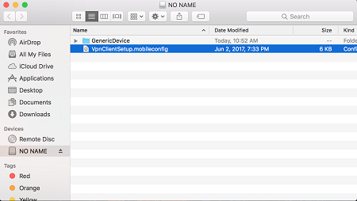
3. Double-click on the profile to install it, click **Continue**. The profile name is the same as the name of your VNet.

  
4. Click **Continue** to trust the sender of the profile and proceed with the installation.

  
5. During profile installation, you are given the option to specify the username and password used for VPN authentication. It's not mandatory to enter this information. If specified, the information is saved and automatically used when you initiate a connection. Click **Install** to proceed.

  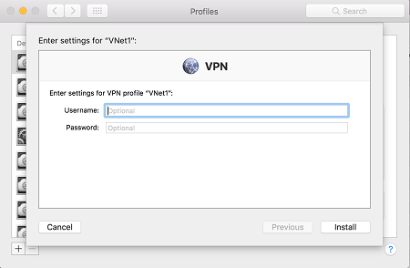
6. Enter a username and password for the necessary privileges required to install the profile on your computer. Click **OK**.

  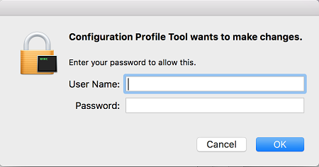
7. Once installed, the profile is visible in the **Profiles** dialog box. This dialog can also be opened later from **System Preferences**.

  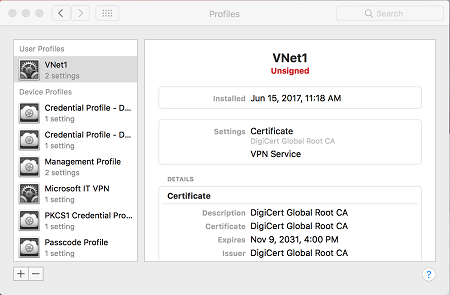
8. To access the VPN connection, open the **Network** dialog from **System Preferences**.

  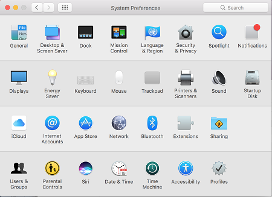
9. The VPN connection shows as **IkeV2-VPN**. The name can be changed by updating the **mobileconfig** file.

  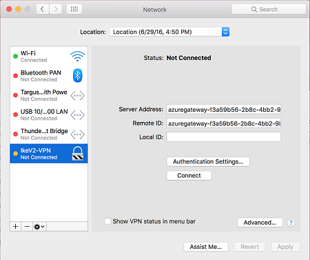
10. Click **Authentication Settings**. Choose **Username** in the drop-down and enter your credentials. If you entered the credentials earlier, then **Username** is automatically chosen in the drop-down and the username and password are pre-populated. Click **OK** to save the settings. This takes you back to the Network dialog box.

  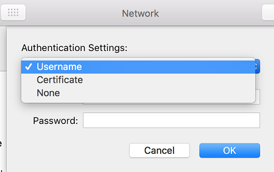
11. Click **Apply** to save the changes. To initiate the connection, click **Connect**.

#### <a name="adlinuxcli"></a>Linux VPN client setup using strongSwan

The following instructions were created using strongSwan 5.5.1 on Ubuntu 17.0.4. Actual screens may be different depending on your version of Linux and strongSwan.

1. Open the **Terminal** to install **strongSwan** and its Network Manager by running the following command. If you receive an error relating to the "libcharon-extra-plugins," replace it with "strongswan-plugin-eap-mschapv2".

  ```Terminal
  sudo apt-get install strongswan libcharon-extra-plugins moreutils iptables-persistent network-manager-strongswan
  ```
2. Click the **Network Manager** icon (up-arrow/down-arrow), and select **Edit Connections**.

  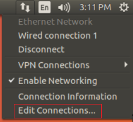
3. Click the **Add** button to create a new connection.

  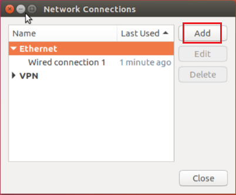
4. Select **IPsec/IKEv2 (strongswan)** from the drop-down menu, then click **Create**. You can rename your connection in this step.

  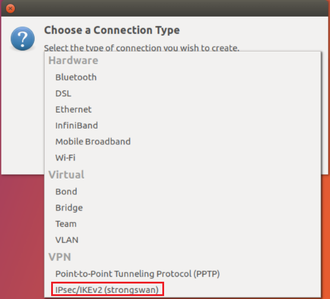
5. Open the **VpnSettings.xml** file from the **Generic** folder of the downloaded client configuration files. Find the tag called **VpnServer** and copy the name, beginning with "azuregateway" and ending with ".cloudapp.net".

  
6. Paste this name into the **Address** field of your new VPN connection under the **Gateway** section. Next, click the folder icon at the end of the **Certificate** field, browse to the Generic folder, and select the **VpnServerRoot** file located there.
7. Under the **Client** section of the connection, choose **EAP** for **Authentication**, and enter your username/password. You may have to select the lock icon on the right to save this information. Then, click **Save**.

  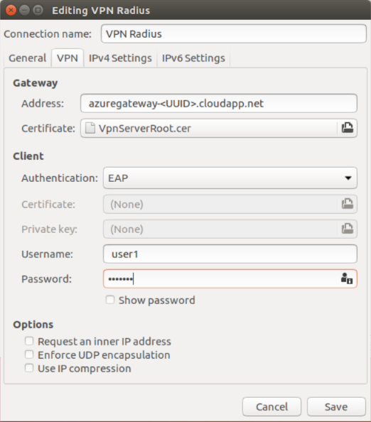
8. Click the **Network Manager** icon (up-arrow/down-arrow) and hover over **VPN Connections**. You will see the VPN connection that you created. To initiate the connection, select it to connect.

  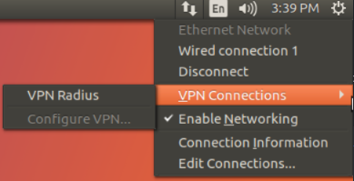

## <a name="certeap"></a>Certificate authentication
 
You can create VPN client configuration files for RADIUS certificate authentication that uses the EAP-TLS protocol. Typically, an Enterprise-issued certificate is used to authenticate a user for VPN. Make sure that all connecting users have a certificate installed on the users' device, and that the certificate can be validated by your RADIUS server.
 
* '-AuthenticationMethod' is 'EapTls'.
* During certificate authentication, the client validates the RADIUS server by validating its certificate. -RadiusRootCert is the .cer file containing the root cert that is used to validate the RADIUS server.
* Each VPN client device requires an installed client certificate.
* Sometimes a Windows device has multiple client certificates. During authentication, this can result in a popup dialog listing all the certificates. The user must then choose the certificate to use. The correct certificate can be filtered out by specifying the root certificate to which the client cert should chain. '-ClientRootCert' is the .cer file that contains the root cert. It's an optional parameter. If the device from which you want to connect has only one client certificate, then this parameter does not have to be specified.

### <a name="certfiles"></a>1. Generate VPN client configuration files

Generate VPN client configuration files for use with certificate authentication. You can generate the VPN client configuration files using the following command:
 
```powershell
New-AzureRmVpnClientConfiguration -ResourceGroupName "TestRG" -Name "VNet1GW" -AuthenticationMethod "EapTls" -RadiusRootCert <full path name of .cer file containing the RADIUS root> -ClientRootCert <full path name of .cer file containing the client root> | fl
```

Running the command returns a link. Copy and paste the link to a web browser to download 'VpnClientConfiguration.zip'. Unzip the file to view the following folders:

* **WindowsAmd64** and **WindowsX86** - These folders contain the Windows 64-bit and 32-bit installer packages, respectively. 
* **GenericDevice** - This folder contains general information used to create your own VPN client configuration.

If you already created client configuration files, you can retrieve them by using the 'Get-AzureRmVpnClientConfiguration' cmdlet. However, if you make any changes to your P2S VPN configuration, such as the VPN Protocol type or authentication type, the configuration doesn’t update automatically. You must run the 'New-AzureRmVpnClientConfiguration' cmdlet to create a new configuration download.

To retrieve previously generated client configuration files, use the following command:

```powershell
Get-AzureRmVpnClientConfiguration -ResourceGroupName "TestRG" -Name "VNet1GW" | fl
```
 
### <a name="setupusername"></a> 2. Configure VPN clients

You can configure the following VPN clients:

* [Windows](#certwincli)
* [Mac (OS X)](#certmaccli)
* Linux (supported, no article steps yet)

#### <a name="certwincli"></a>Windows VPN client setup

1. Select a configuration package and install it on the client device. For a 64-bit processor architecture, choose the 'VpnClientSetupAmd64' installer package. For a 32-bit processor architecture, choose the 'VpnClientSetupX86' installer package. If you see a SmartScreen popup, click **More info**, then **Run anyway**. You can also save the package to install on other client computers.
2. Each client requires a client certificate in order to authenticate. Install the client certificate. For information about client certificates, see [Client certificates for Point-to-Site](vpn-gateway-certificates-point-to-site.md). To install a certificate that was generated, see [Install a certificate on Windows clients](point-to-site-how-to-vpn-client-install-azure-cert.md).
3. On the client computer, navigate to **Network Settings** and click **VPN**. The VPN connection shows the name of the virtual network that it connects to.

#### <a name="certmaccli"></a>Mac (OS X) VPN client setup

A separate profile must be created for every Mac device that connects to Azure VNet. This is because these devices require the user certificate for authentication to be specified in the profile. The **Generic** folder has all the information required to create a profile.

  * **VpnSettings.xml** contains important settings such as server address and tunnel type.
  * **VpnServerRoot.cer** contains the root certificate required to validate the VPN gateway during P2S connection setup.
  * **RadiusServerRoot.cer** contains the root certificate required to validate the RADIUS server during authentication.

Use the following steps to configure the native VPN client on Mac for certificate authentication:

1. Import the **VpnServerRoot** and the **RadiusServerRoot** root certificates to your Mac. This can be done by copying the file over to your Mac and double-clicking it.  
Click **Add** to import.

  *Add VpnServerRoot*

  

  *Add RadiusServerRoot*

  
2. Each client requires a client certificate in order to authenticate. Install the client certificate on the client device.
3. Open the **Network** dialog under **Network Preferences** and click **'+'** to create a new VPN client connection profile for a P2S connection to the Azure VNet.

  The **Interface** value is 'VPN' and **VPN Type** value is 'IKEv2'. Specify a name for the profile in the **Service Name** field, then click **Create** to create the VPN client connection profile.

  
4. In the **Generic** folder, from the **VpnSettings.xml** file, copy the **VpnServer** tag value. Paste this value in the **Server Address** and **Remote ID** fields of the profile. Leave the **Local ID** field blank.

  
5. Click **Authentication Settings** and select **Certificate**. 

  
6. Click **Select…** to choose the certificate that you want to use for authentication.

  
7. **Choose An Identity** displays a list of certificates for you to choose from. Select the proper certificate, then click **Continue**.

  
8. In the **Local ID** field, specify the name of the certificate (from Step 6). In this example, it is "ikev2Client.com". Then, click **Apply** button to save the changes.

  
9. On the **Network** dialog, click **Apply** to save all changes. Then, click **Connect** to start the P2S connection to the Azure VNet.

## <a name="otherauth"></a>Working with other authentication types or protocols

To use a different authentication type (for example, OTP), and not username/password or certificates, or to use a different authentication protocol (such as PEAP-MSCHAPv2, instead of EAP-MSCHAPv2), you must create your own VPN client configuration profile. To create the profile, you need information such as the virtual network gateway IP address, tunnel type, and split-tunnel routes. You can get this information  by using the following steps:

1. Use the 'Get-AzureRmVpnClientConfiguration' cmdlet to generate the VPN client configuration for EapMSChapv2. For instructions, see [this section](#ccradius) of the article.

2. Unzip the VpnClientConfiguration.zip file and look for the GenenericDevice folder. Ignore the folders containing the Windows installers for 64-bit and 32-bit architectures.
 
3. The GenenericDevice folder contains an XML file called VpnSettings. This file contains all the required information.

  * VpnServer - FQDN of the Azure VPN Gateway. This is the address that the client connects to.
  * VpnType - the tunnel type that you use to connect.
  * Routes - Routes that you have to configure in your profile so that only Azure VNet bound traffic is sent over the P2S tunnel.
  * The GenenericDevice folder also contains a .cer file called 'VpnServerRoot'. This file contains the root certificate required to validate the Azure VPN Gateway during P2S connection setup. Install the certificate on all devices that will connect to the Azure VNet.

## Next steps

Return to the article to [complete your P2S configuration](point-to-site-how-to-radius-ps.md).