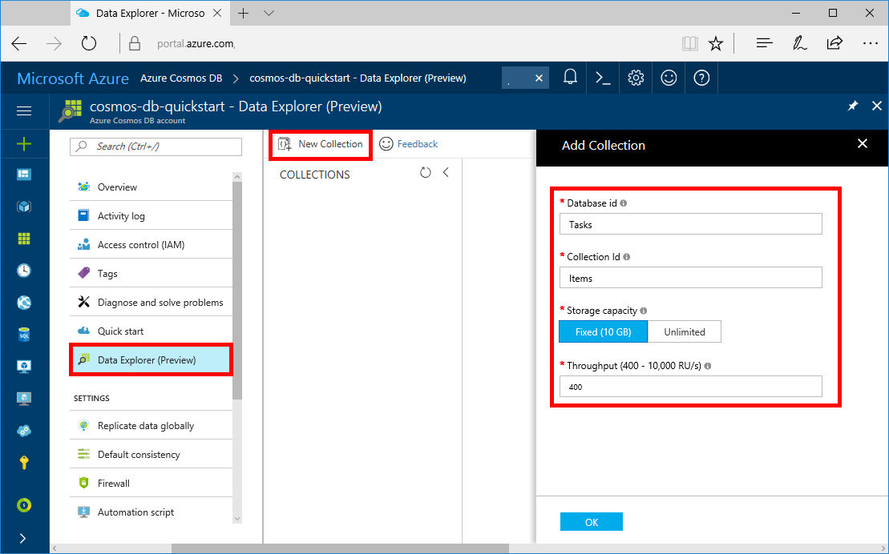
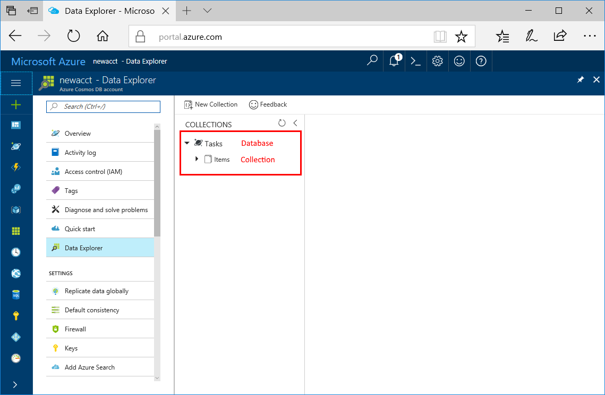

You can now use the Data Explorer tool in the Azure portal to create a database and collection. 

1. Click **Data Explorer** > **New Collection**. 
    
    The **Add Collection** area is displayed on the far right, you may need to scroll right to see it.

    

2. In the **Add collection** page, enter the settings for the new collection.

    Setting|Suggested value|Description
    ---|---|---
    Database id|Tasks|Enter *Tasks* as the name for the new database. Database names must contain from 1 through 255 characters, and they cannot contain /, \\, #, ?, or a trailing space.
    Collection id|Items|Enter *Items* as the name for your new collection. Collection ids have the same character requirements as database names.
    Storage capacity| Fixed (10 GB)|Change the value to **Fixed (10 GB)**. This value is the storage capacity of the database.
    Throughput|400 RU|Change the throughput to 400 request units per second (RU/s). Storage capacity must be set to **Fixed (10 GB)** in order to set throughput to 400 RU/s. If you want to reduce latency, you can scale up the throughput later. 
    
    Click **OK**.

    Data Explorer displays the new database and collection.

    