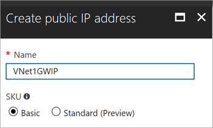

1. In the portal, on the left side, click **+** and type 'virtual network gateway' in search. Locate **Virtual network gateway** in the search return and click the entry. On the **Virtual network gateway** page, click **Create** at the bottom of the page to open the **Create virtual network gateway** page.
2. On the **Create virtual network gateway** page, fill in the values for your virtual network gateway.

   
3. On the **Create virtual network gateway** page, specify the values for your virtual network gateway.

   - **Name**: Name your gateway. This is not the same as naming a gateway subnet. It's the name of the gateway object you are creating.
   - **Gateway type**: Select **VPN**. VPN gateways use the virtual network gateway type **VPN**. 
   - **VPN type**: Select the VPN type that is specified for your configuration. Most configurations require a Route-based VPN type.
   - **SKU**: Select the gateway SKU from the dropdown. The SKUs listed in the dropdown depend on the VPN type you select. For more information about gateway SKUs, see [Gateway SKUs](../articles/vpn-gateway/vpn-gateway-about-vpn-gateway-settings.md#gwsku).
   - **Location**: You may need to scroll to see Location. Adjust the **Location** field to point to the location where your virtual network is located. If the location is not pointing to the region where your virtual network resides, when you select a virtual network in the next step, it will not appear in the drop-down list.
   - **Virtual network**: Choose the virtual network to which you want to add this gateway. Click **Virtual network** to open the 'Choose a virtual network' page. Select the VNet. If you don't see your VNet, make sure the Location field is pointing to the region in which your virtual network is located.
   - **Gateway subnet address range**: You will only see this setting if you did not previously create a gateway subnet for your virtual network. If you previously created a valid gateway subnet, this setting will not appear.
   - **First IP configuration**: The 'Choose public IP address' page creates a public IP address object that gets associated to the VPN gateway. The public IP address is dynamically assigned to this object when the VPN gateway is created. VPN Gateway currently only supports *Dynamic* Public IP address allocation. However, this does not mean that the IP address changes after it has been assigned to your VPN gateway. The only time the Public IP address changes is when the gateway is deleted and re-created. It doesn't change across resizing, resetting, or other internal maintenance/upgrades of your VPN gateway.

     - First, click **Create gateway IP configuration** to open the 'Choose public IP address' page, then click **+Create new** to open the 'Create public IP address' page.
     - Next, input a **Name** for your public IP address. Leave the SKU as **Basic** unless there is a specific reason to change it to something else, then click **OK** at the bottom of this page to save your changes.

       

4. Verify the settings. You can select **Pin to dashboard** at the bottom of the page if you want your gateway to appear on the dashboard. 
5. Click **Create** to begin creating the VPN gateway. The settings are validated and you'll see the "Deploying Virtual network gateway" tile on the dashboard. Creating a gateway can take up to 45 minutes. You may need to refresh your portal page to see the completed status.

After the gateway is created, view the IP address that has been assigned to it by looking at the virtual network in the portal. The gateway appears as a connected device. You can click the connected device (your virtual network gateway) to view more information.
